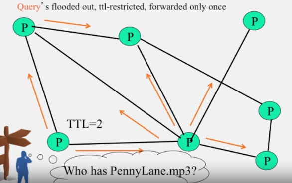

https://www.coursera.org/learn/cloud-computing/lecture/cZQdb/3-gnutella

No servers, clients are servers (servents - peers)
each peer store its own files and peer pointers

communicate through internet

5 main message types:
- query (search)
- query hit (response)
- ping
- pong
- push (initiate file transfer)

communicate using http request, metadata stored in header

query messages use TTL restriction

  

each peer maintain a list of recently received messages to a void duplicate

support range params in GET request to support partial file transfer

problems:
- ping-pong consume 50% traffic - solution: cache, reduce ping pong frequency
- repeated search with the same keyword - solution: cache
- when hosts connect through a modem, it can be a bottleneck - solution: use a central server as proxy