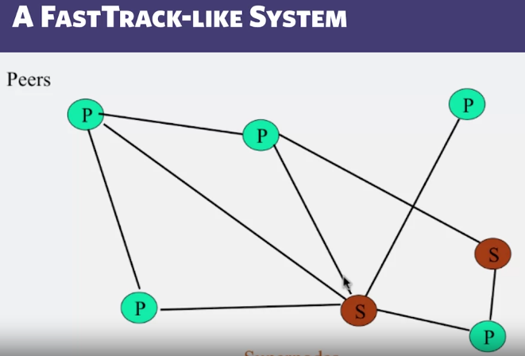
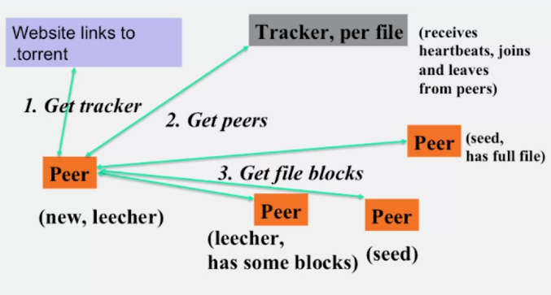

# FastTrack is A combination of Gnutella and Napster

When a client earn enough reputation (ex: upload enough file,...) it can become a Super node S

when a client query, query Super Node first

  

# BitTorrent

The node originally uploaded the file is called SEED node, which has full file

Other peers replicate some blocks of that file

Use past requests to find out best download rate peer

When request to download file, looking for rarest block first

  