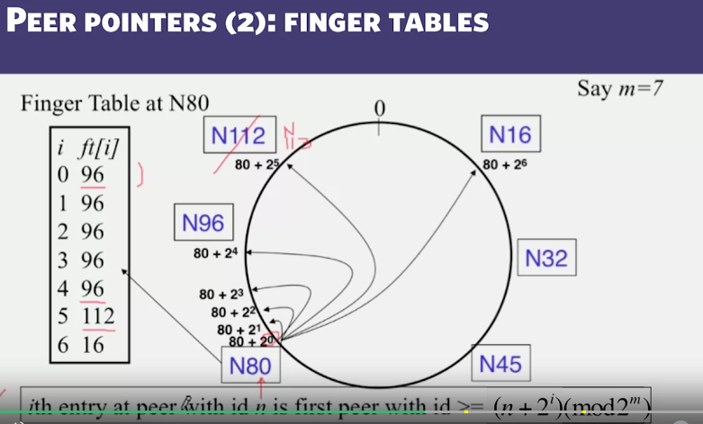

a cluster has up to 2^m peers (id from 0 to 2^m - 1)

SHA-1(ip, port) -> 160 bit string -> truncate to m bits -> peer id

2 type of peer pointers
- successors
- finger table

Each peer maintain its own Finger Table

  