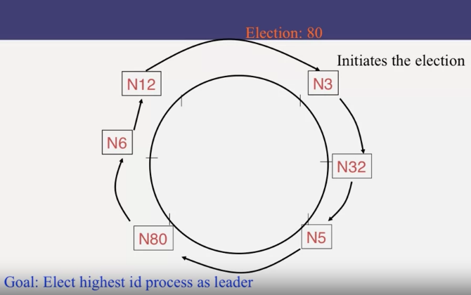
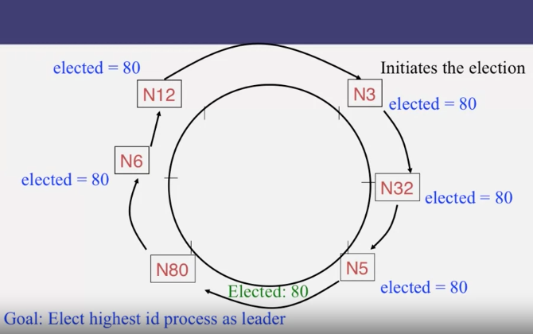

# Init the election
use Bully algorithm, which node has highest ID becomes the LEADER

Each node send its ID to clock-wise direction peer, if it's ID larger than leader's ID in message, overwrite the message to its ID and send to next peer  

When the message goes to hightest ID node, It will send **ELECTED** message

  

  

# Zookeeper and Google chubby

use quorum acceptance, when a majority of group accept a leader -> then that node become a leader

use two phase of **commit**

1, send NEW_LEADER message
2, each receiver send **at most** 1 ACK message
3, who get more ACK will send COMMIT message
4, who get COMMIT will update its new leader