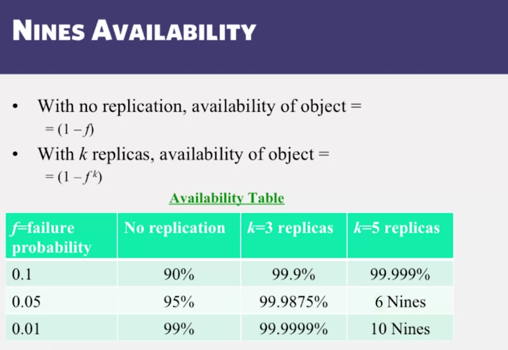

# Nines availability

# Replication maintain two properties
- TRANSPARENCY - clients dont need to know about replication under the hood
- CONSISTENCY - all client see single copy of data, not replication, ACID for transactions

# Two type of replications consistency
- passive replication: use a master
- active replication: treats all replica identically (clickhouse)

replication is multicasted inside the replicas group, by using a leader election algorithm