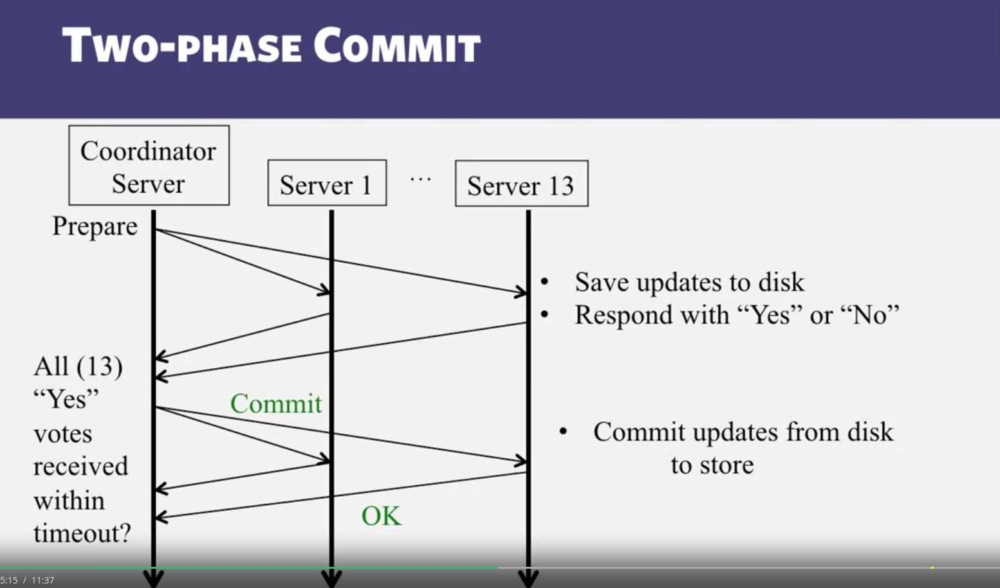

# One phase commit
use a coordinator to tell other servers to commit or abort

- issues:
  - one server can not commit, while other servers have committed
  - servers may crash before receiving commit message, but having updates in memory

# Two phase commit

### Prepare phase
- Coordinator send update to all servers, servers save updates to disk
- Servers response back with YES or NO

### Commit phase
- If Coordinator receive any NO or waiting timeout, send ABORT
- Otherwise, send COMMIT message

