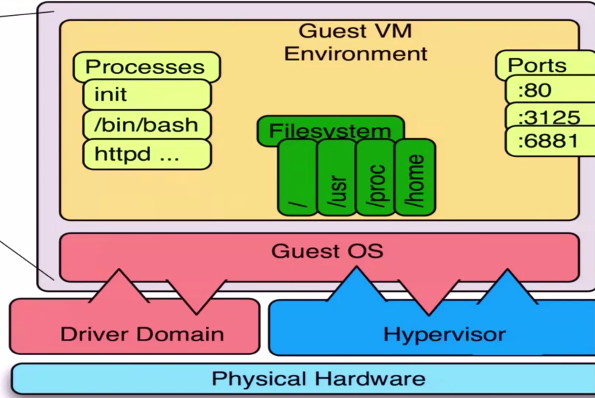
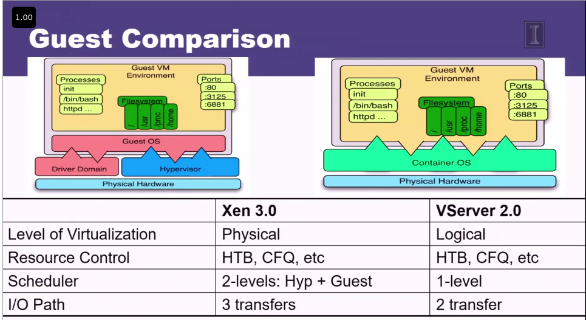
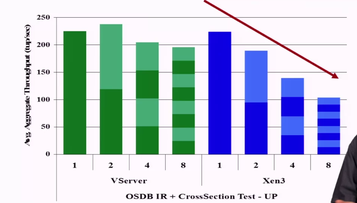

# Xen

In Xen, we have two main components who responsible for virtualization
- Driver domain: responsible for mapping: addresses, file system folders, ...
- Hypervisor: allocating resources, security, which Guess access which resources

# VServer 2.0

In VServer, there are no Hypervisor or Resources mapping, that's all done by OS logic

this reduce a lots of complexity in our design, but make OS logic much more complicated

comparing performance VServer vs Xen

