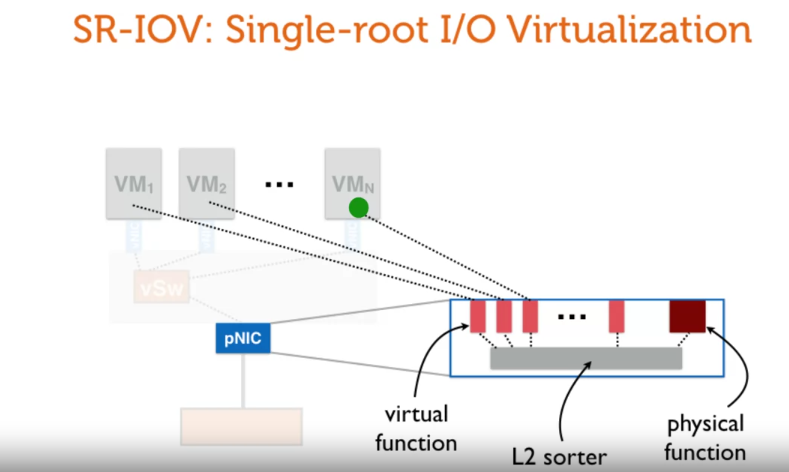

# networking in virtualization

in naive approach, networking in virtualization requires hypervisor to handle sending packages to VMs => CPU intensive

### Single-root I/O virtualization

the idea is, like hardware virtualization CPUs, we enable NIC to support virtualization inside it, then the VMs can access directly to NIC without depending on hypervisor

