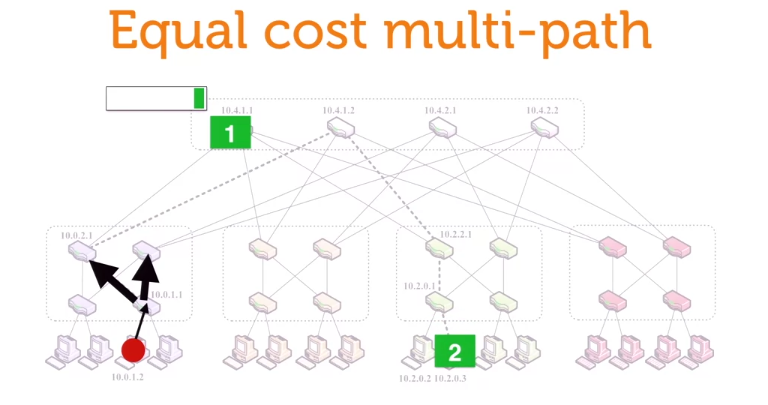
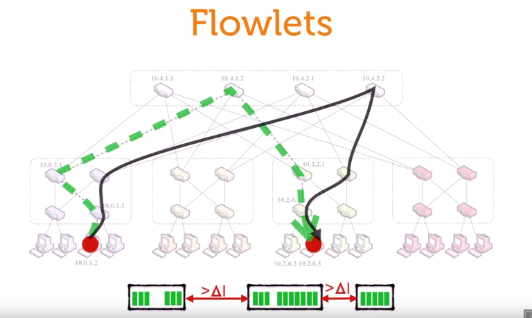
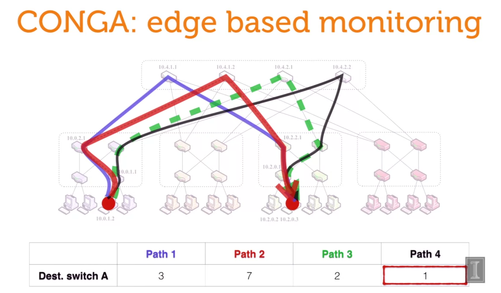

# parallel multi-path routing

assume that host A want two send two packages (ordered) to host B, in a distributed way. Then each package will be sent through a different route.
But package 1 route seems to be congestion, then the package 1 will arrive later than package 2, which leads to unordered, then TCP will count that as a failed transmission

# Flowlets

we have an idea, which is, calculate the different time between two route (which are used to sent 2 packages), that differential called delta T, if the time received of two packages larger than delta T, so there are congestion, then those packages will be considered as correct, although they are received at unorder

# CONGA

another idea is monitoring the whole system, to detect if there is any congestion, then avoid it. By maintaining a path table of each node, then our system can itself determine which path to send for each package

