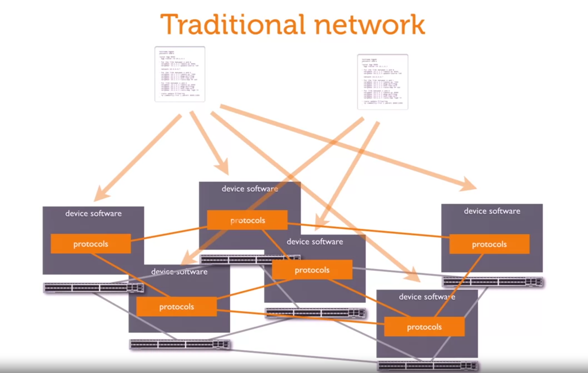
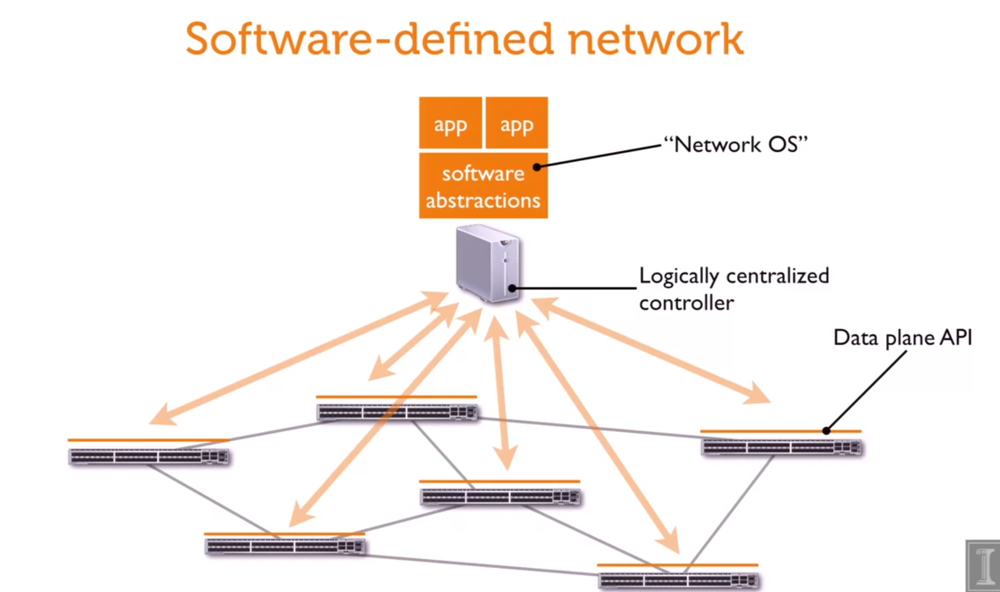
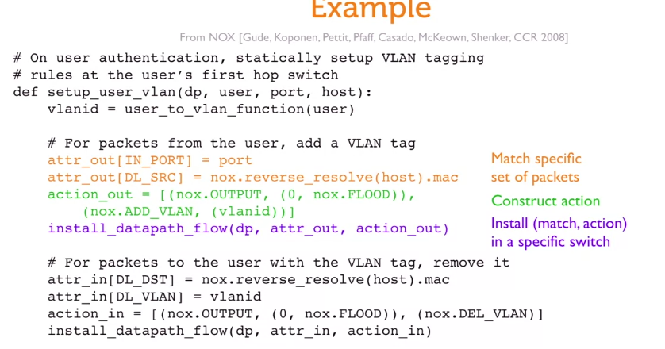

# old system

we have some configuration file, then apply them to each server in the network

this cause hard to get a global state of the network, or applying new configuration

# software-defined architecture

this new idea is centralize all configuration in one place, then we have OS, interfact to control the entirely network

