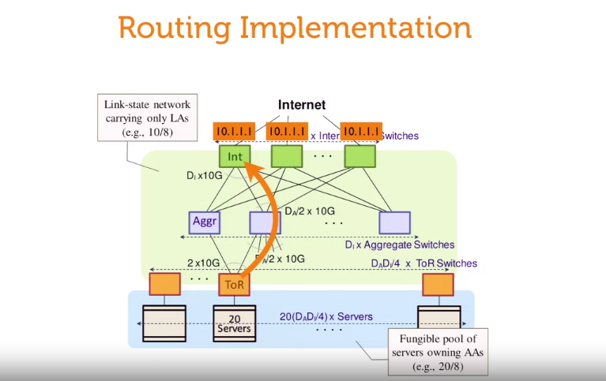
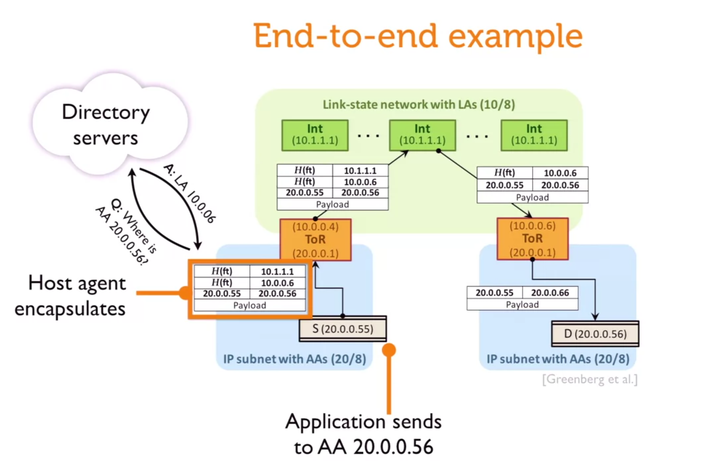

# a simple idea is virtualize the network (but not easy in implementation)

# behavior

when node 20.0.0.55 want to send to node 20.0.0.56
1. call directory server to get 20.0.0.56 location in the network
2. host agent encapsulate 20.0.0.55 message with it's address (10.0.0.6) and intermediate node address (10.1.1.1)
3. send to upper intermediate layer (10.1.1.1)
4. then intermediate layer decapsulate the message to get host to send to

