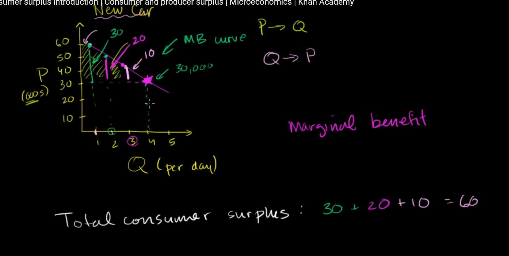
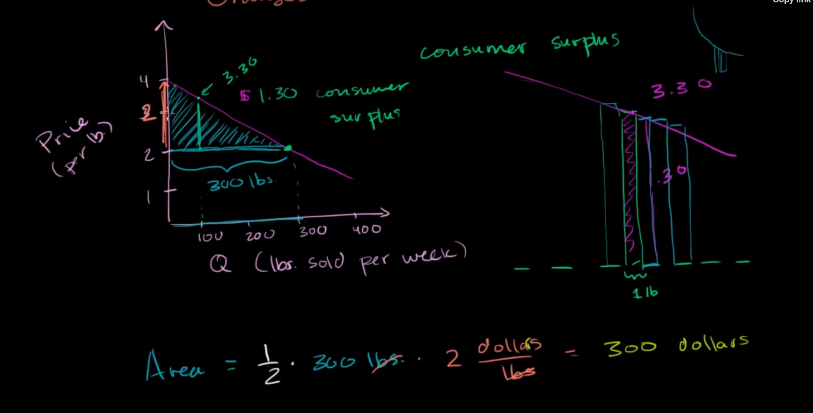
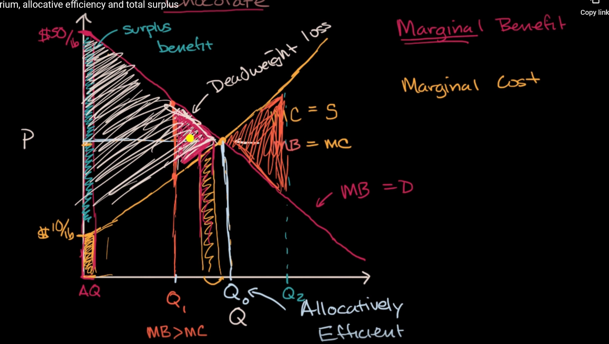

**marginal benefit** - Lợi ích cận biên

is the max price that consumer willing to pay for a product

e.g: when you going to buy your first car, you can pay upto 60k$, instead of actual 30k$ of that product, but when you have more car, your exciting about cars go down, and you willing to pay less as you were

when they want to buy more, their maximum price willing for that product will reduce

consumer are expecting it at 60, but the actual price is 30, then their marginal benefit is **willingness - actual** = 60 - 30 = 30

**consumer surplus** is total marginal benefit until the next time, consumer's willingness to pay is equal to it's actual price

**consumer surplus** can be calculated as an area

# Allocative eficiency is the point at which marginal benefit equals to marginal cost

at that point, good is produced most effectively

