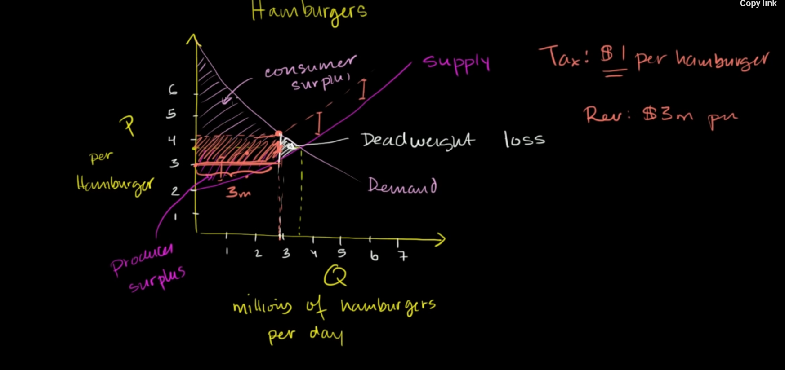
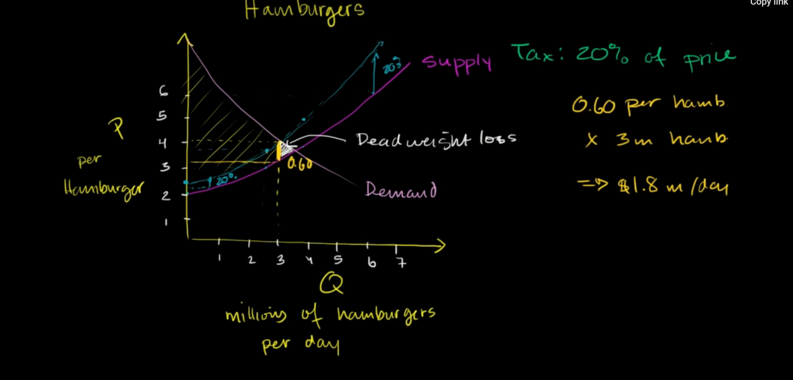

# tax leads to deadweight loss
consider a normal model of consumer and producer surplus, when the government put a tax on price, it can reduce total surplus 

because the price has gone up, to get the same revenue the producers have to increase the selling price, while consumers do not have that more money to afford -> reduce in consumer surplus

# tax in percentage

when putting tax on percentage, for larger price, more income for government

