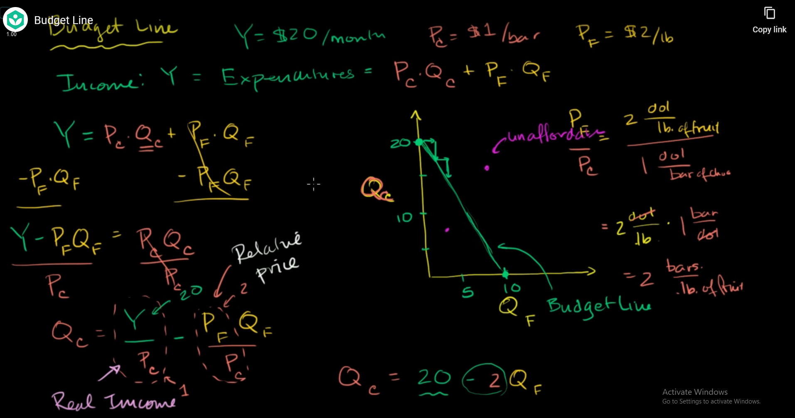

assume that we have an income of 20$ per month

you want to spend on chocolate 1$ per bar or fruit 2$ per pound

so when buying chocolate, you give up opportunity on buying fruit

what beyond budget line is unaffordable

