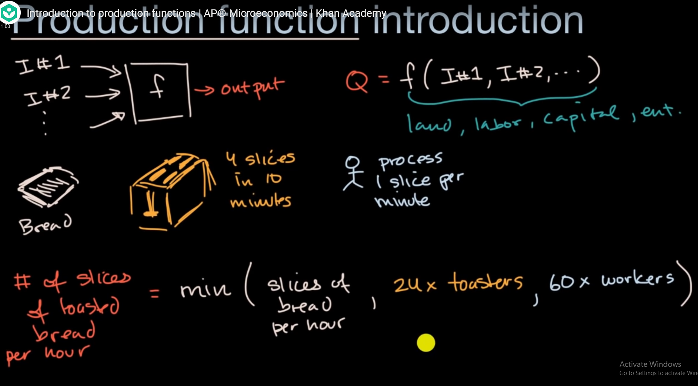
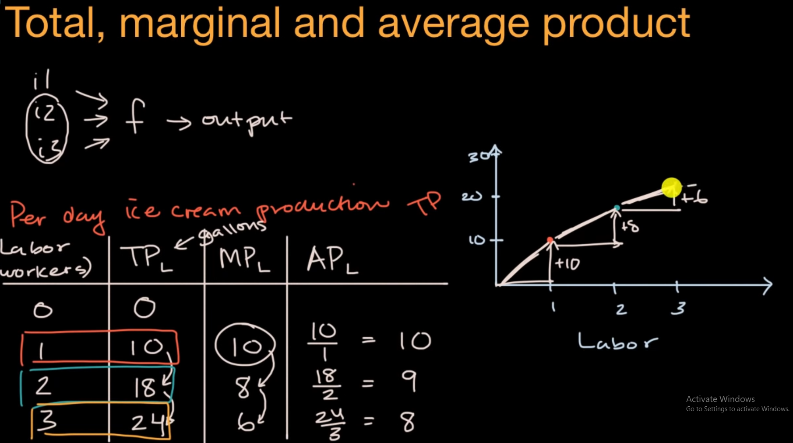

product function can be used to estimate the production of input as parameters (land, labor, capital, entrepreneur)

# total product, marginal product and average product

marginal product diminishing on more labor added

