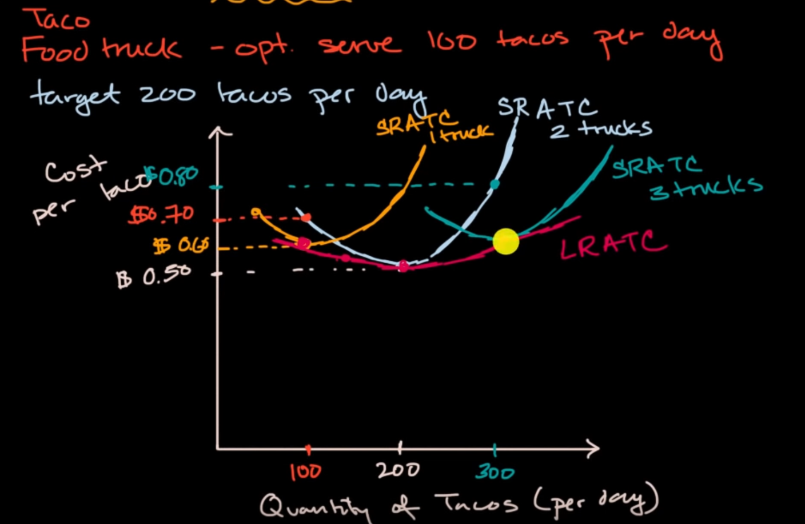
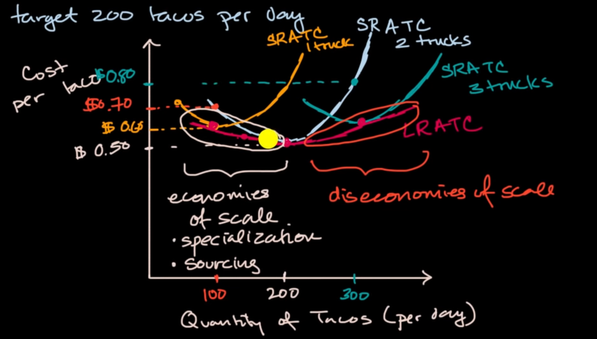

we only have an optimal point of fix cost, at which the average total cost is smallest

when we try to change the fixed cost by market demand from the optimal point, we only get higher ATC. The curve of every optimal point of Short Run ATC curve with fixed cost variant is Long Run Average Total Cost curve 

# so why do we have this curve?

this is because of scale reasons, when our organization grow at some extend, It lose its efficiency, maybe for communication. For small organization, we can use our resources at optimal, so that is the reason why increasing fixed cost may lead to increase of average total cost 

this is economies and diseconomies of scale

