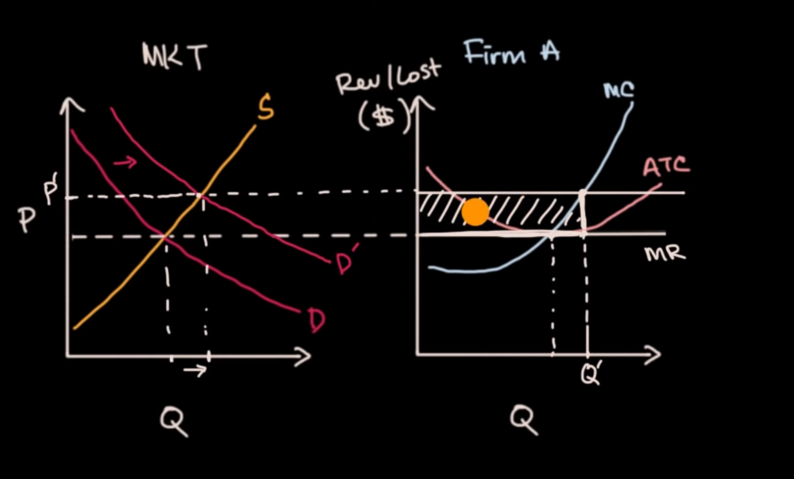
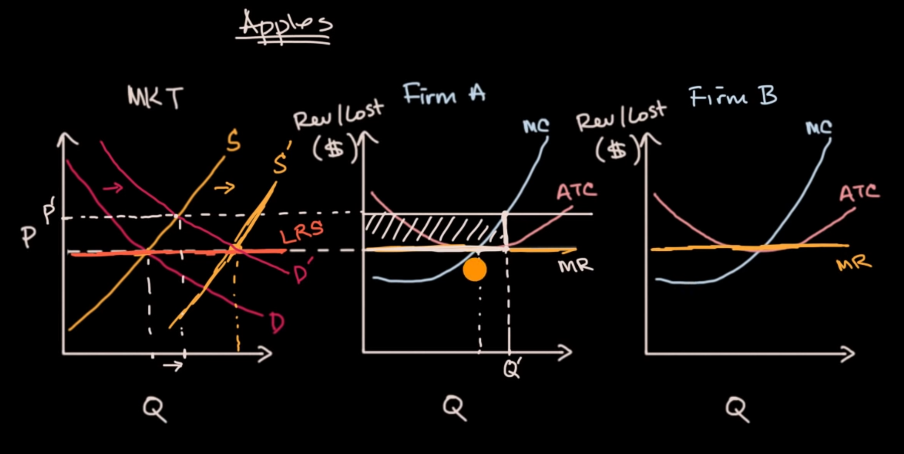
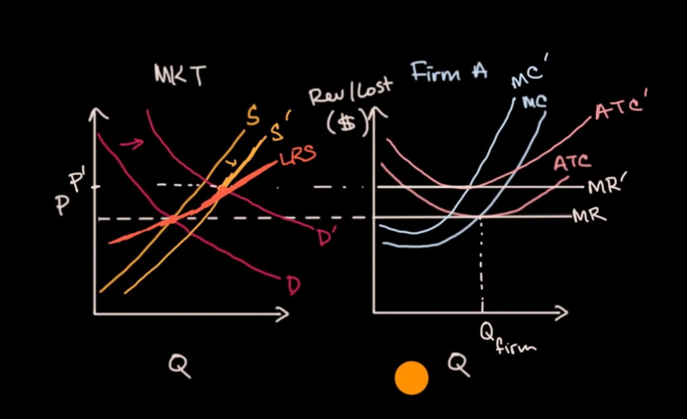

# constant cost in a perfectly competitive market

consider a perfectly competitive market for apple

in the short run, as the demand goes up, Firm A will get positive economic revenue

but this is a perfectly competitive market, so there is no boundary for entry/exit, so more Firms will enter the market (because of positive revenue). Then, the market price will reduce

if the cost structure of all Firms in the market are equal (because of perfectly competitive market), then at some point of time, the market price will be equal to all Firms' ATC, then there is not any economic revenue can be made

then the demand curve, will be constant

# long run industry when costs are not constant

if the costs are not constant, more firm entering the market will make costs go up

then in the long run, although this is a perfectly competitive market and all firms will get zero economic revenue, the supply curve will have trend upward

