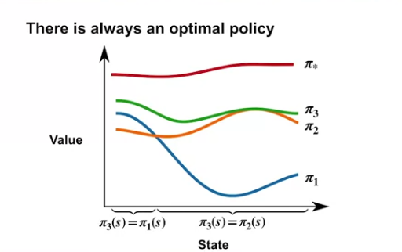
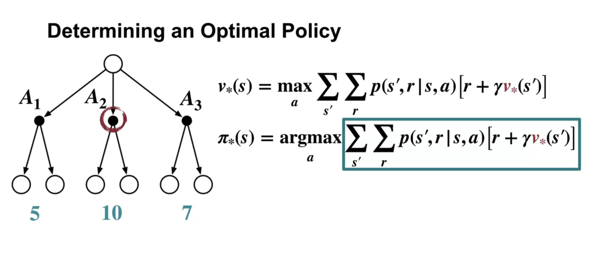

### An optimal policy means, at every state, it ALWAYS get the best reward (including gamma acounting factor)

# $\pi_{*}$

### Optimal value function

Optimal value function has the greatest value in every state

### Optimal policy

**given** an optimal values for every state, we can compute the optimal policy

# $\pi_{*}$ = aggrmax (next state and reward) given optimal value function

