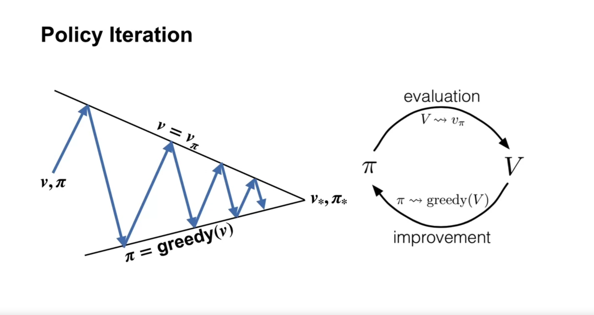
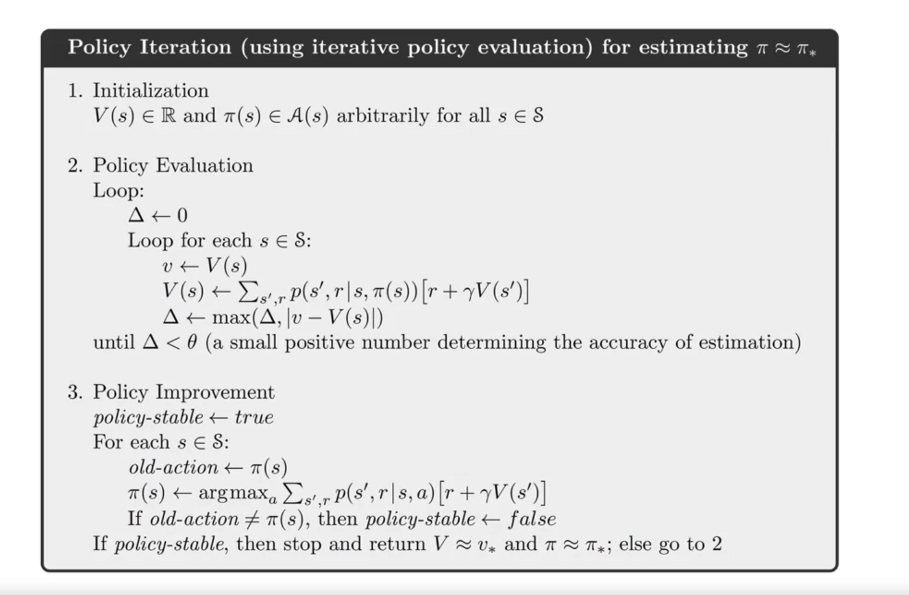
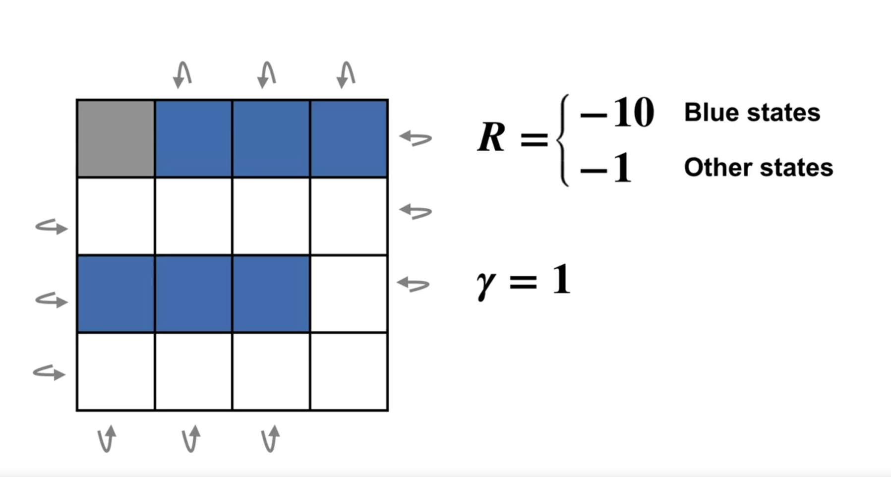
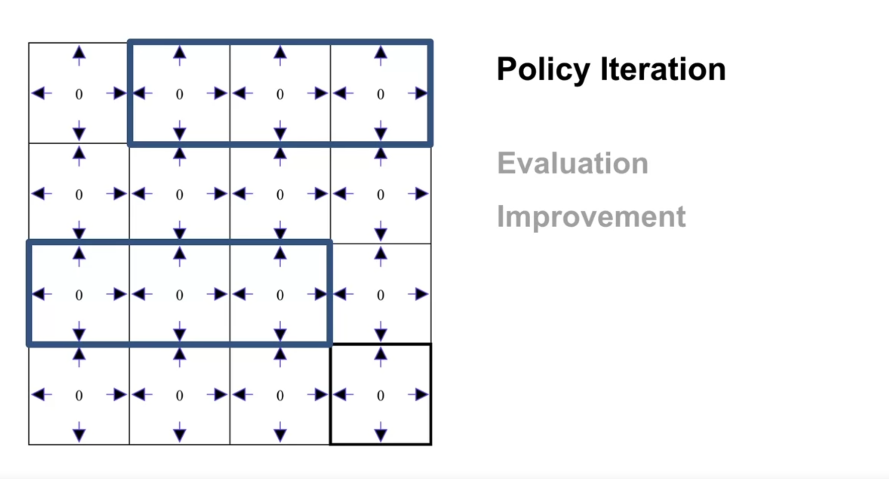
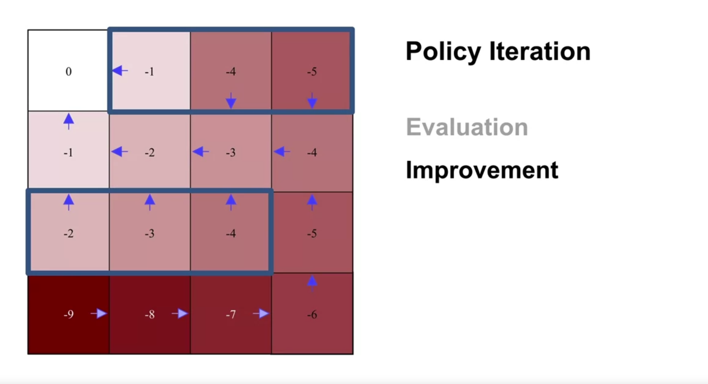

evaluate and update, until our values can not improve any more -> that is the **unique optimal** value function, then -> the optimal policy

policy always be updated by the **GREEDY** method, which will result in the best **values**

we start from a random policy, then will end up with an optimal policy

when reach the optimal point, our policy will behave well

