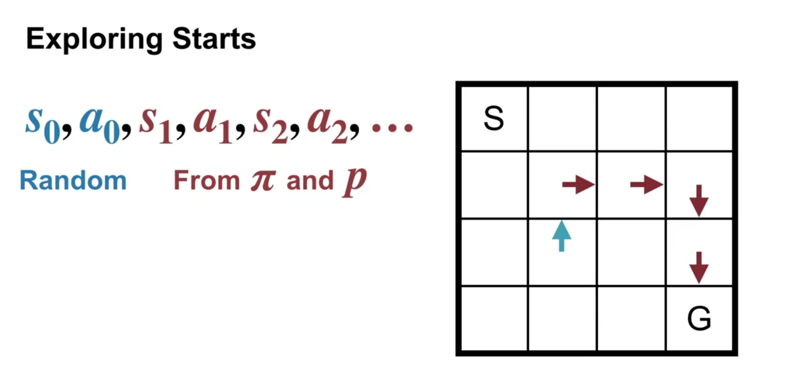
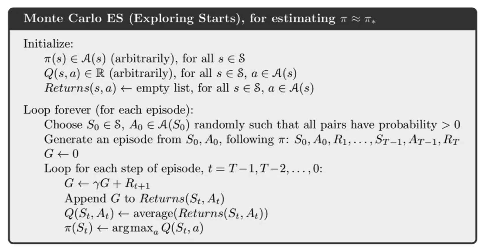

When learning, if the policy always choose a specific action, then the agent may not know if there is any action better

we can apply Monte Carlo by randomly initialize at a random state, then take a random action and finish episode with that initialization

# Monte Carlo learning algorithm

