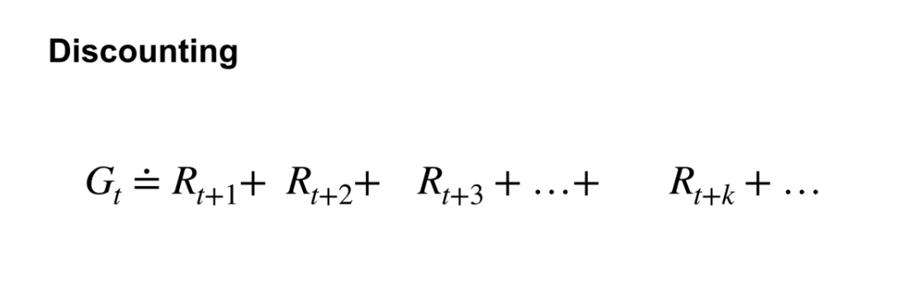
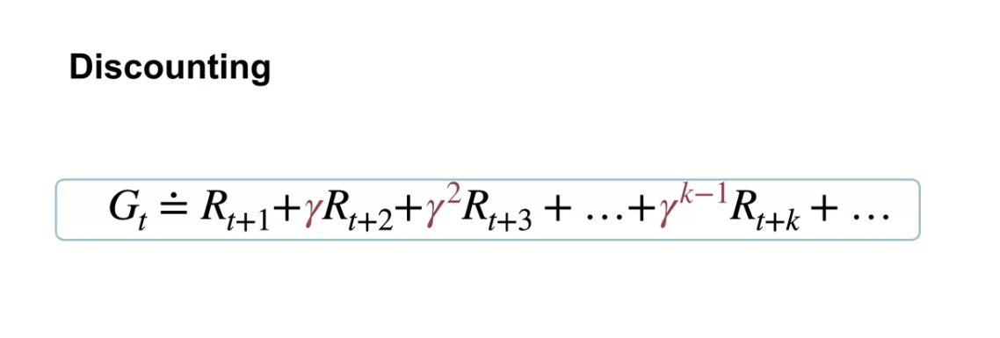
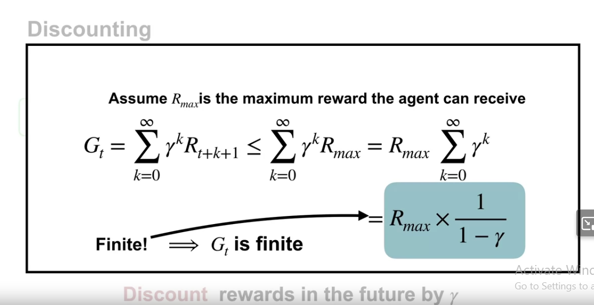

we defined a function to compute current state reward based on future states, which is called **discounting**

the basic idea is: summing up all future rewards

but for continuing tasks, this function seem to approach infinity because we don't know when our period stop (this is continuing tasks)

to avoid our function approach infinity, we defined **gamma**, the **discount rate**

0 < gamma < 1

this can tune our agent to focus on immediate reward or care more about the future

so our Gt can not approach infinity

if we implement our native formula, we will have the simple recursive equation

