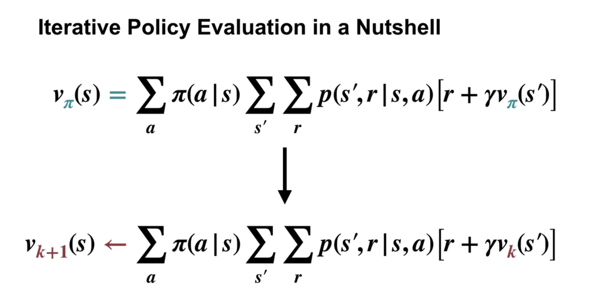
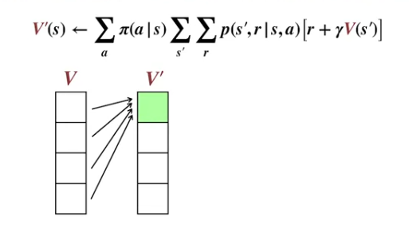
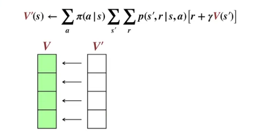
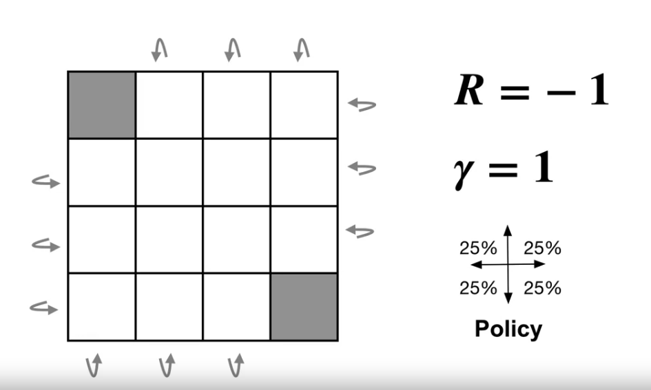
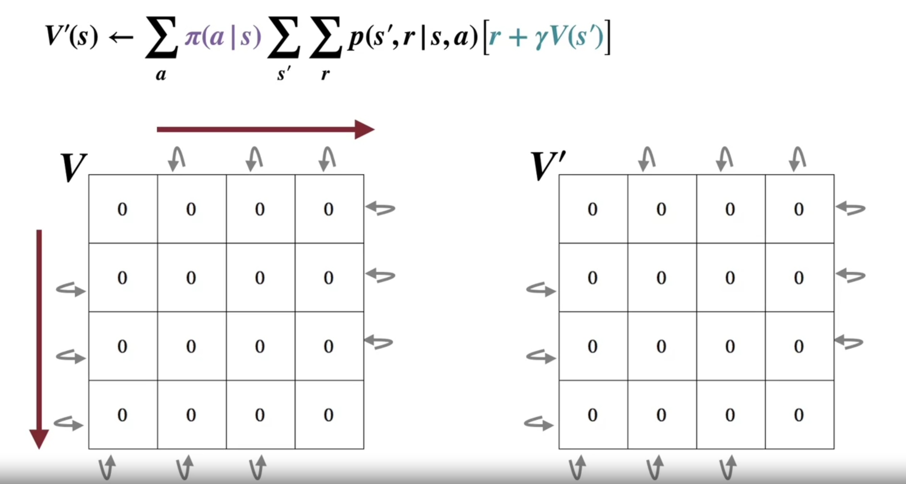
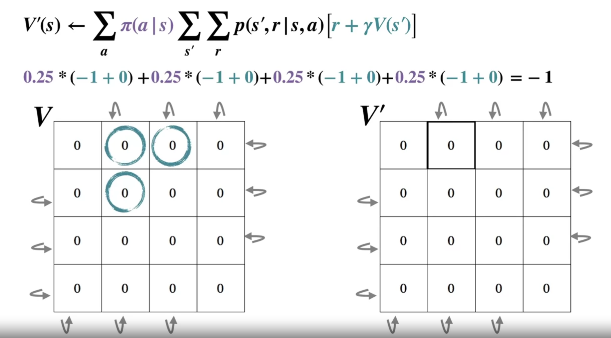
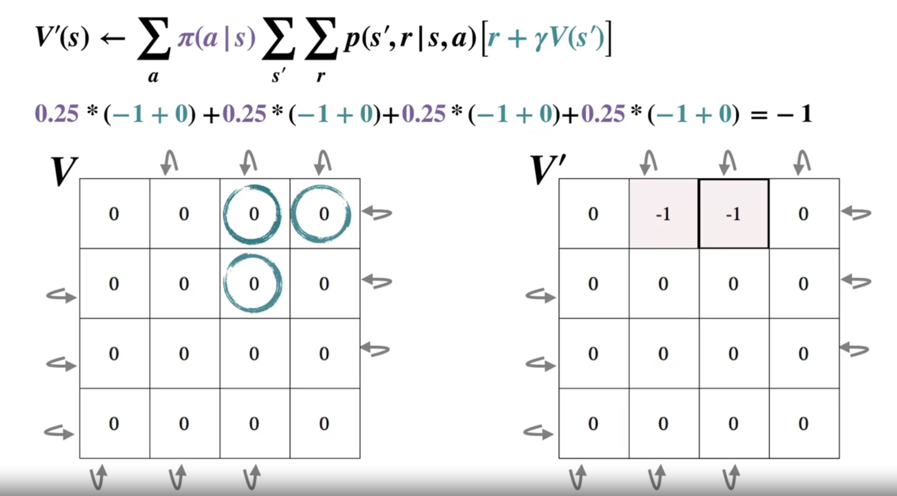
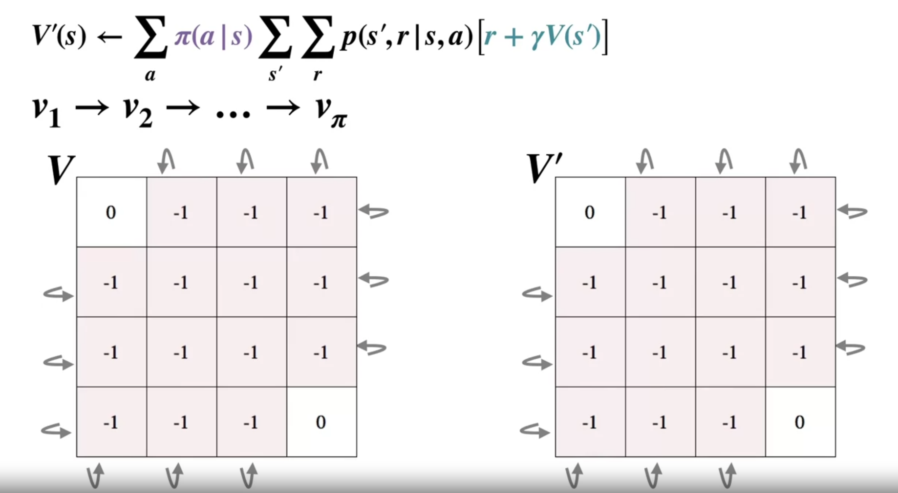
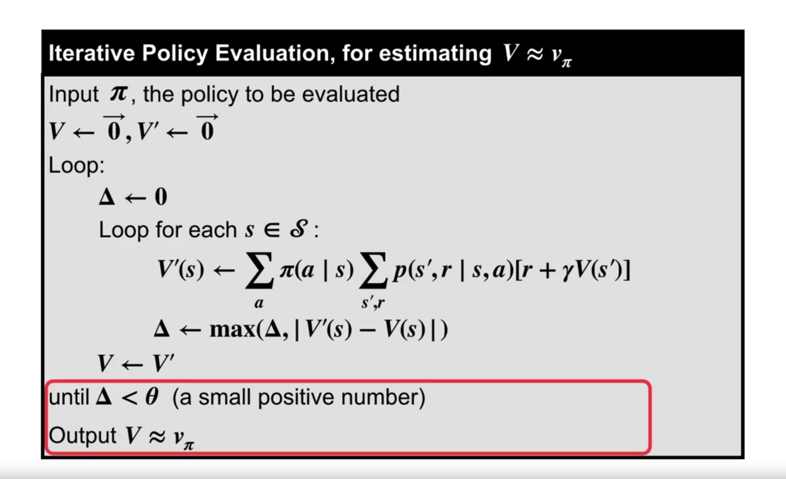

we can actually "Learn" a value function

# iterative policy evaluation
compute new values based on current values -> update new values -> repeat until no improvement

we can update our current value based on our native recursive equation

### compute new values

calculate new value for every states based on last values

### update old values

then update all new values to old values

# Example

step 1: init values

step 2: compute new value based on new states' values

step 3: update old values

# Pseudo code

