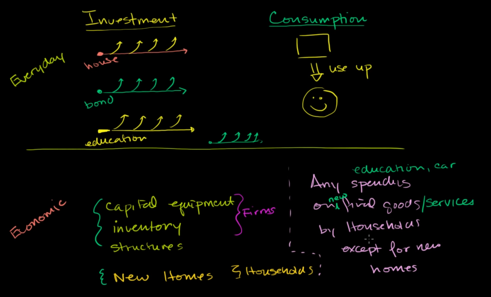

we will compare investment and consumption in two context:

# Everyday Context
- **investment** is you pay money to something, and you gain from it everyday, for example:
  - education
  - house

- **consumption** is you spend money on thing and use up in short term
  - eating
  - movie 

# Economic context
- investment is buying capital to produce more things in the future
- consumption is spending in goods

