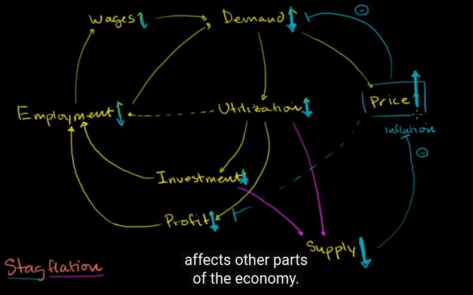
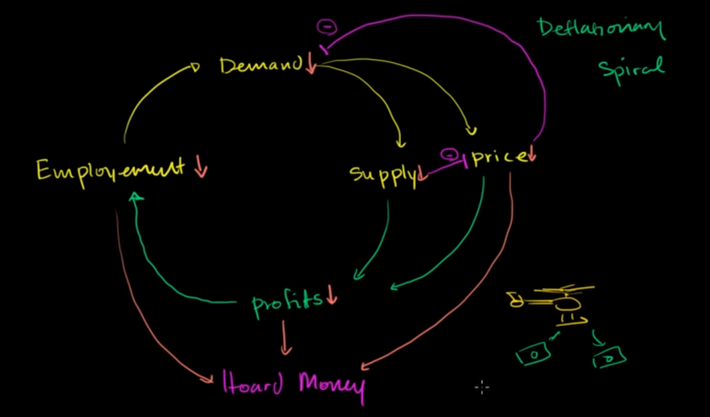

# stagflation

stagflation is the situation when something unexpected happen to reduce supply dramatically

# Deflationary Spiral

in a depressed economy, when a part of it, consider Employment go down, this makes all other factors go down.

When the good price goes down, money is becoming more valuable

so people tend to save their money, the more time they wait, the more they can get from their money

