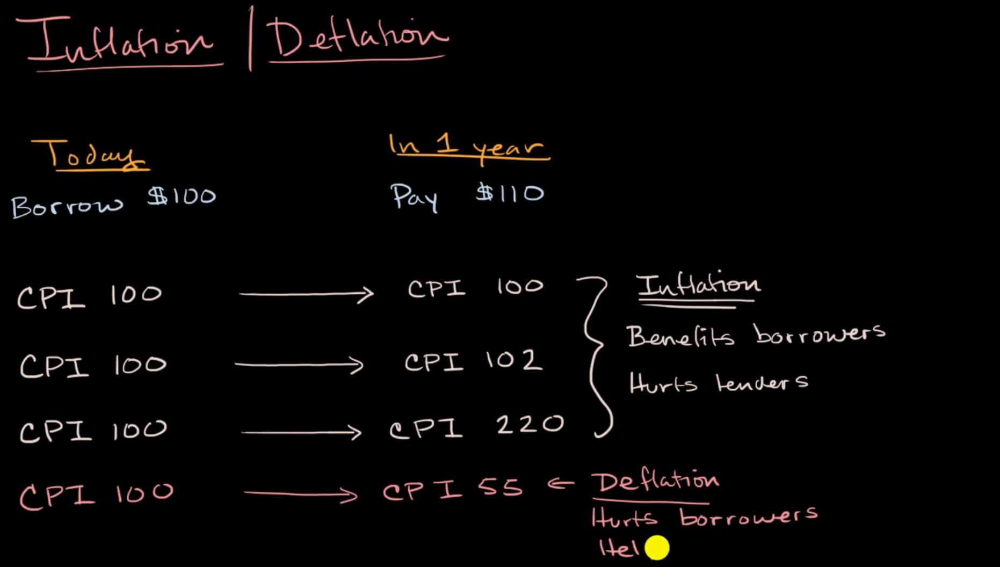

the decrease or increase in money value can affect borrowers and lenders

imagine you borrow 100$, with 10% interest, then return it 1 year later. But now the CPI increase by 20%, so your lender is suffering from inflation

