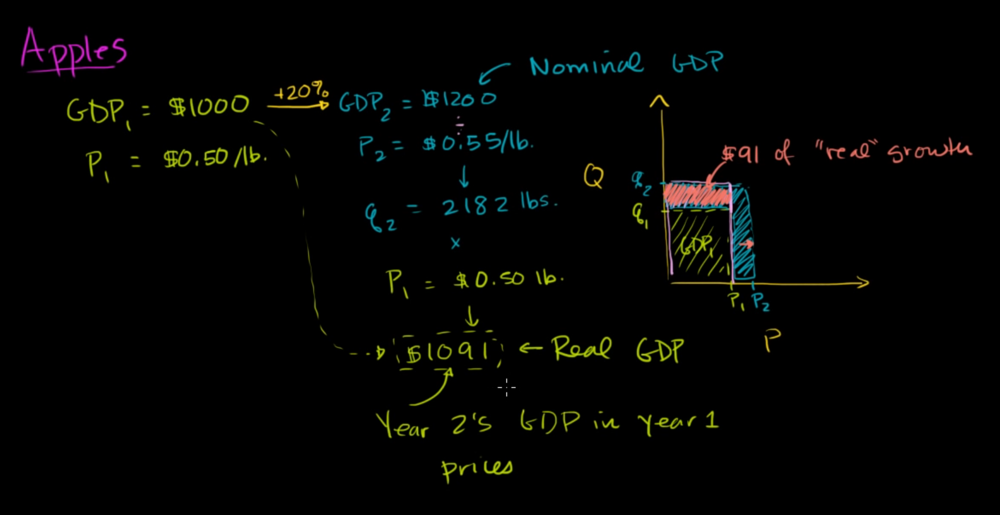

on estimating the growth of a country by GDP, we compare its GDP to previous years.

But we should care about the price (or, inflation rate) of that year.

we can see GDP increase every year, but its not effective if inflation rate increase with that amount

