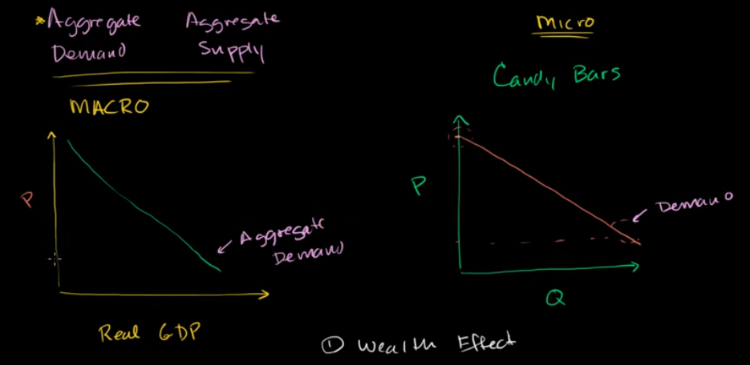

aggregate supply and demand, differ from microeconomics concepts

on thinking about aggregate demand, we should thinking about the whole economy, not for the market of just one good or service

in macroeconomic context, when price goes down, it tends to increase the gdp

why?

### wealth effect
when the price goes down, and other factors remain the same, people wake up in the morning then found they have a lot of money in their account (mean they can buy more things with that same money), so their demand for products increase -> this cause supply increase -> GDP increase

### saving interest rate effect
price decrease, and others remain the same, people will have more money in their saving -> there will be more money for banks to lend -> more money in the economy for building houses, factories, more money on investment -> increase GDP

### foreign exchange
price decrease -> demand for that country goods increase, for example, US cars used to be 10000$, with 10000$ = 5000 pounds, but now 10000$ only equals to 4000 pounds, so English people tend to buy US car -> this will increase NET export -> increase GDP