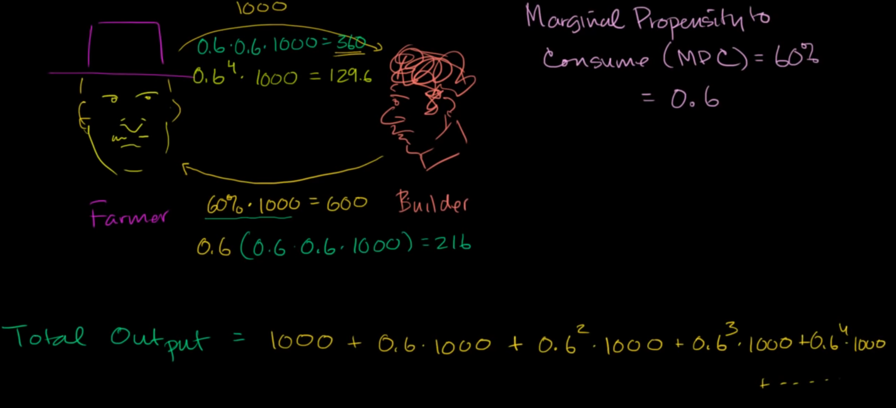

# Marginal Propensity to Consume - MPC 

MPC is a fraction of income that people can spend

for example: a Builder got 1000$ as income, he has MPC = 0.6, then he can spend 600$ to buy food

# Multipliers
for an economy, when we put (or invest) some money into it, this economy can use that money to recursively increase its production

ex: Farmer paid 1000$ to Builder for repairing his house, then the Builder, with MPC = 0.6, spent 600$ to Farmer on buying food. Then Farmer can continue spending 360$ (0.6 of 0.6 of 1000$) to hire the Builder expand his silo, ...

This is a recursive relation, our economy is a circle

