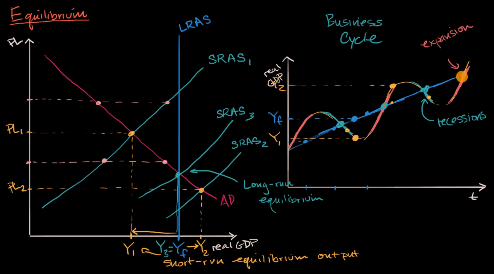

in the short run, the supply and demand will adjust themselves to the equilibrium point. But that point is not the maximum for longrun aggregate supply can serve. If an economy can not produce at its maximum longrun aggregate supply, this is not efficient

the production of an economy tends to go up and go down, for example, in covid 19 period, the demand for information technology is so high, firms always in shortage of human resources. But after the pandemic, they laid off a lots, bring the market back to its normal situation

