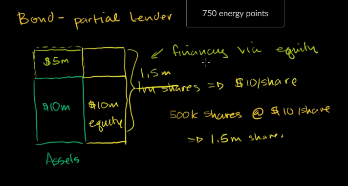
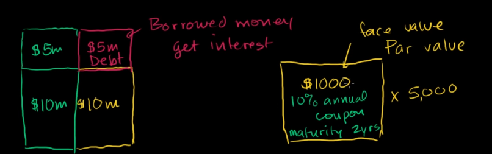

# Share and Bond
when a company want to grow up, It has two ways
- invite someone to invest money, then share the profit
- borrow and pay for interest, without sharing the profit

companies can borrow from bank, but banks have a way to get more profit from this

banks introduced **bonds**, then people can buy it

when the interest rate change, bonds' price can be changed

bonds' price has inverse ratio to interest rate

when interest rate goes up, then the borrowed money is more valuable, bonds' value goes down

for example: you paid 1000$ for a coupon, with expectation that you will get 1100$ one year later. But the market interest rate is 15$, then that bond make you lose 5% on comparing to normal interest rate