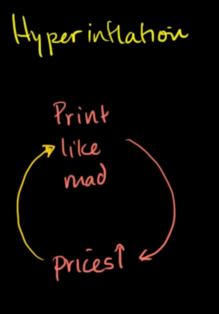

1, medium of exchange
2, store of value
3, unit of value

# what cause functions of money break: Hyperinflation

when the supply goes down, people do not meet their demand -> price goes up -> need more money to pay. But the supply still can not go up -> price even goes up higher

