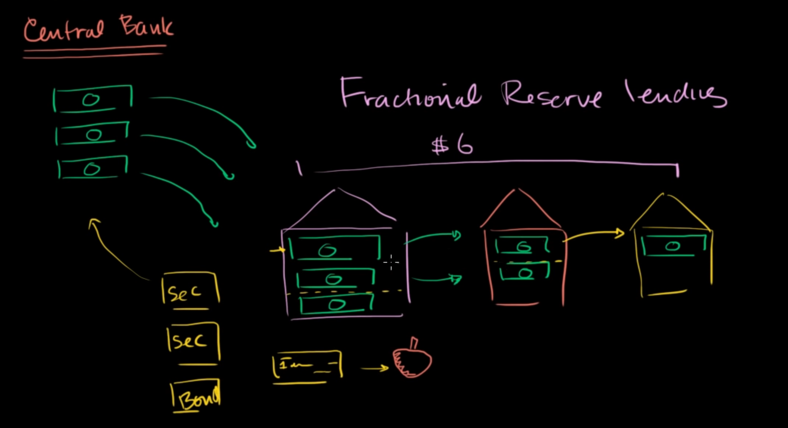

when central bank issue money, assume that people lend all that money in a bank, then that bank have to keep a faction of that money inside it, then lend out the rest to the market, somehow that money goes into another bank. This form our fractional reserve banking system.

To avoid people from taking their money out at the same time together, banks issue **checks**, which can be used as money, without taking money out from bank to afford transactions.

