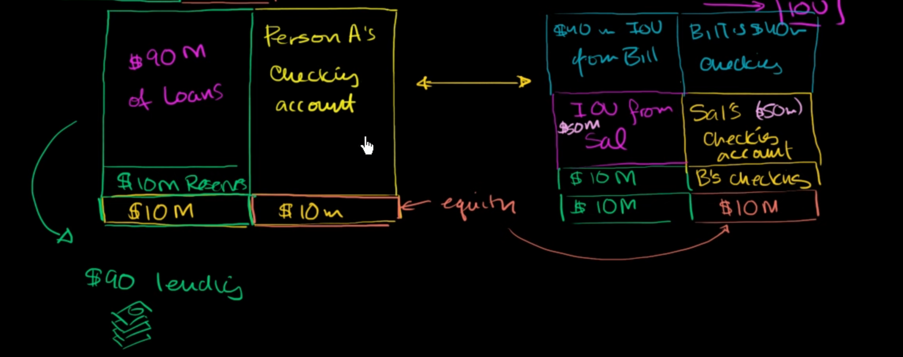

when a person deposit 100M to a bank, the bank only has to reserve at least 10% of that money, 10M then loan out 90%.

in another case, the bank do not have that amount of money, but they can loan out, at least they have 10% of that amount to lent out

for example, the bank B only have 10M in its reserve account, but when a person come and borrow 100M, it can still loan out that amount, then the IOU of that person can be considered as asset of that bank

