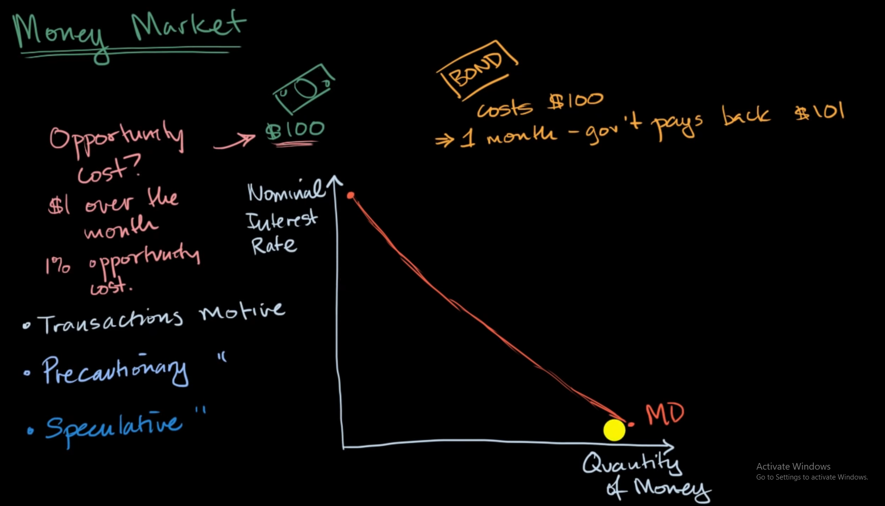
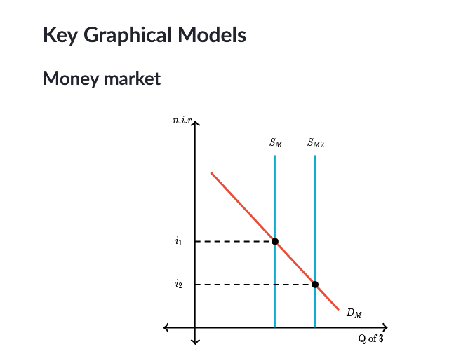

when interest rate is high, people tend to lend their money to bank, this make the supply of money go down

# The money supply is vertical
the money supply is only be determined by the government. They can in crease the amount "base" money by printing then lending out into circulation. So the money supply doesn't depend on the interest rate. That's why we have a vertical money supply

# The nominal interest rate adjusts until the money market is in equilibrium
money market is the same as other market. It can adjust itself to the point of equilibrium