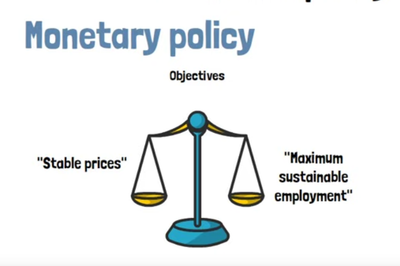
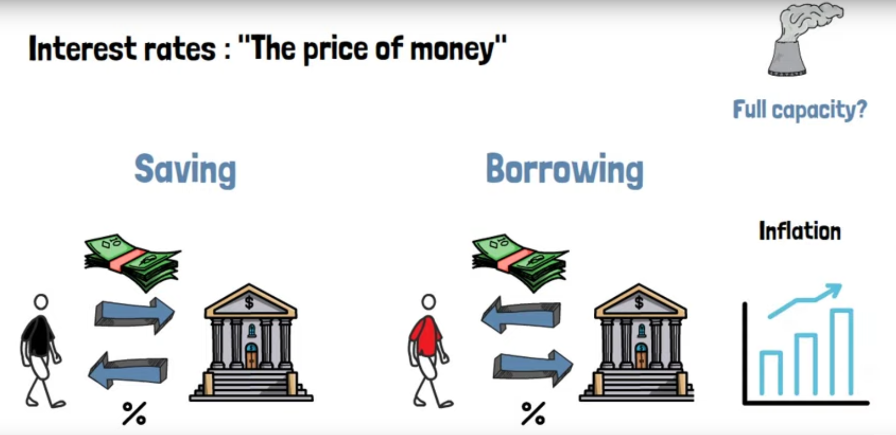
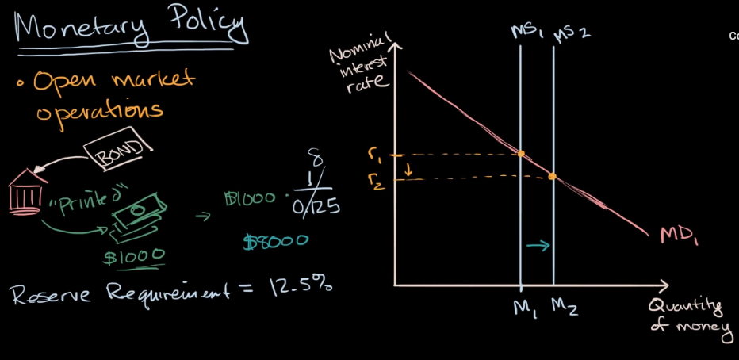

# objectives: keep stable price while maximum sustainable employment

interest rate is the "price of money". So choosing between saving and borrowing is always a trade-off

when the interest rate is high, people prefer to save their money in bank rather than making investment

when the interest rate is low, people tend to borrow more money to make investment, or buying stuff. When more investment and more stuffs get produced, this can cause production go up to full employment capacity, while the money supply still remain. Then putting more money into circulation only cause inflation.

# to increase the money supply

1, open market operation

the banks can sell bonds, then it can lend out 10 times of that money (due to minimum reserve requirement). Which increase the amount of money in circulation, then lower interest rate

2, change discount rate (interest rate that the central bank charge other banks)

3, change minimum reserve ratio requirement
lower reserve ratio requirement means more money can be lend out by banks, which increases money supply

