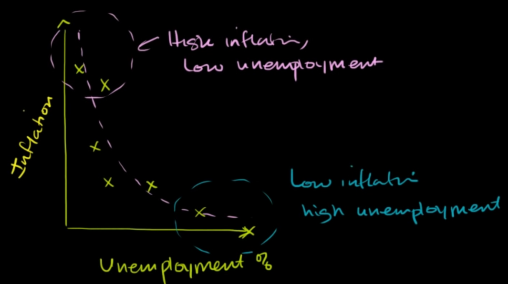
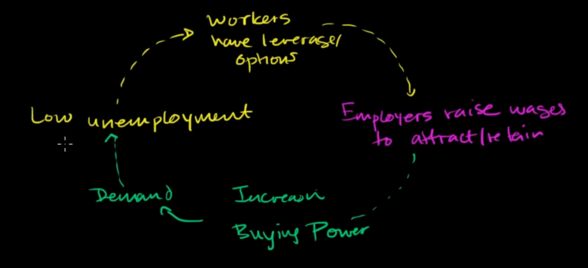

the Phillips curve indicate the correlation between unemployment rate and inflation

**Lower unemployment, higher inflation**

when employment is maximize, it make worker have more options to choose -> employers have to increase wages to attract worker -> increase buying power (people now have more money) -> increase demand -> low unemployment (supply need to increase to serve the demand now higher) -> worker have more options

