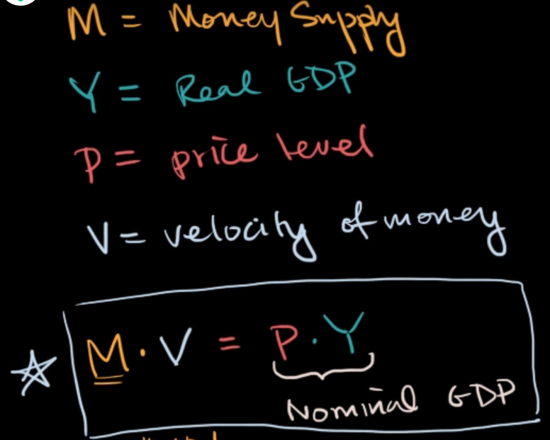
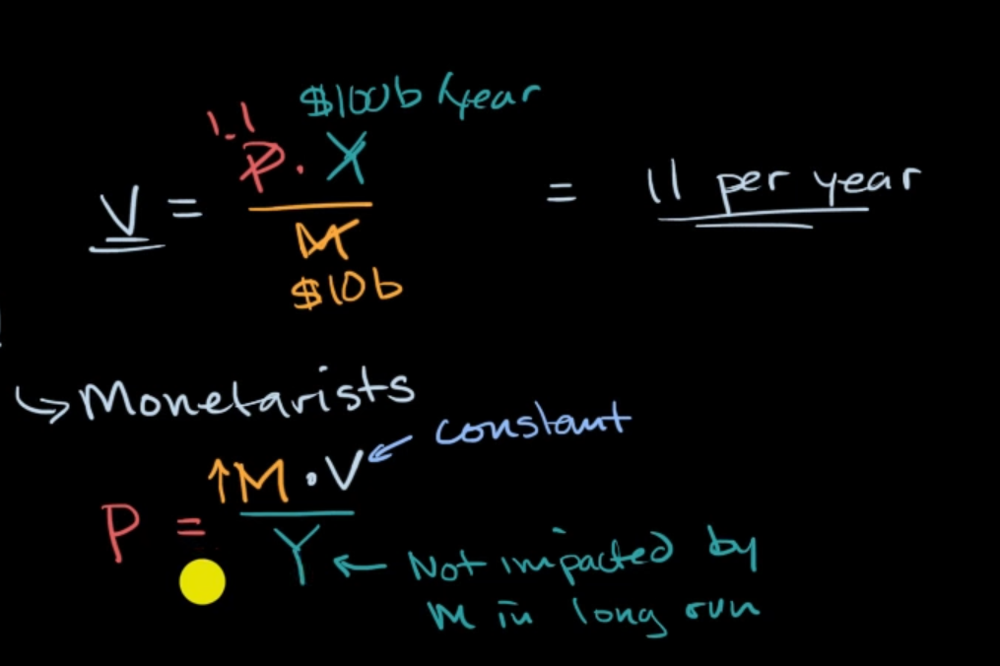
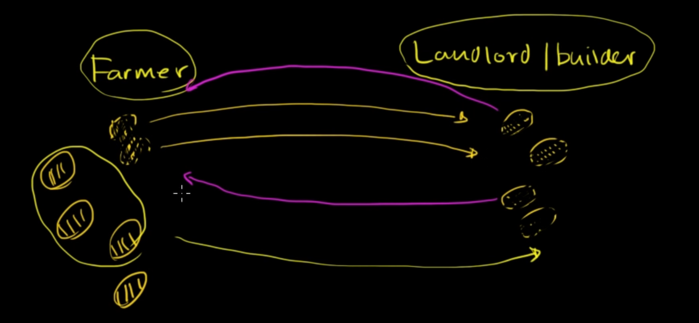

you have an **initial amount** of money, then the **how fast** that money circulate around the economy is **real GDP**

observation show that velocity is nearly constant, and real GDP is not impacted by Money supply in the long run, then increase money supply do increase the price level

# velocity of money rather than quantity driving prices

when the economy is stable, if we want to produce more, which means workers have to extend their work hour, we have to pay more. Then after many time of that, the price level has gone up, just by we push our employment faster

