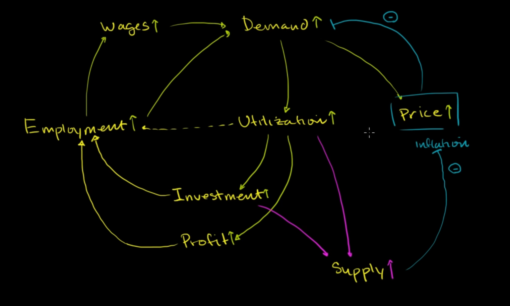

employment increase -> wages increase -> people have more money so demand increase -> increase price (which is a little inflation) and utilization increase. although price increase has a negative effect to demand, but its not considerable. utilization increase -> investment increase and then supply increase -> decrease price (lower inflation)

this is why a bit of inflation is good for an economy

