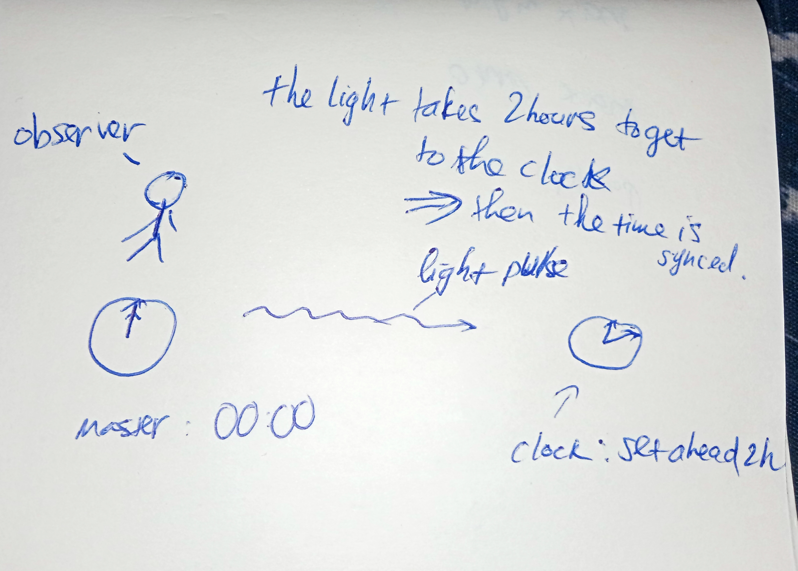

in a point of 3d space, an event has its own x, y, z and t

every single point in the space can have its clock

when the light come from an event, record the clock, take a picture, thats called observe an event

# How to calculate time from two location?

we can not get all clocks to the same location then move them apart, because moving cause time differential

so all the clocks have to stay at their own location

we can use a light pulse, send to all clock, then from that set other clocks ahead.

