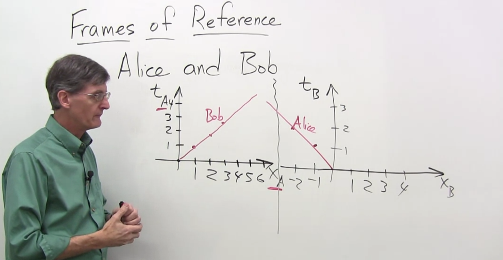

Alice and Bob, each has their own synchronized clocks. When they are moving and see the other's movement, they will consider themself not moving, and the one moving is the other. That is Frame of reference.

Each one has their own spacetime diagram. This is the relativity of movement

