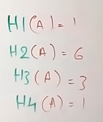
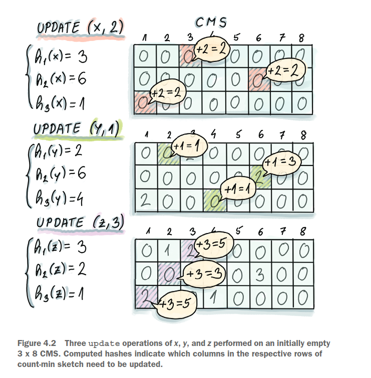
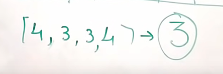

# Count min sketch

### Update (Insert)

we use a sketch (2D array) and a group of hash functions H (h1, h2, ... , hn)

we can compute frequency in a stream with CMS like this

- whenever an element E appear, count all hash values of H(E) = {h1(E), h2(E), ... ,hn(E)}

- updated all hashed value in the sketch by 1

### Estimate

when we need to compute frequency of an element E, just take all hashed values of it then find the minimum sketch

### Why its named Count Min Sketch

The min sketch of an element E is the value with least other elements have the same hashed values as E

So the min value will be the most correct value

