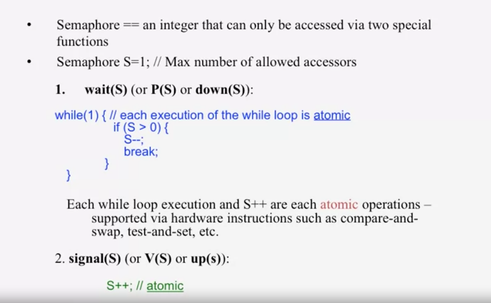

# two process in the same OS share variables

to ensure only one changes was made to the same resource, we have 3 interface
- enter()
- AccessResource()
- exit()

  

# distributed mutual exclusion

### 1, centralize  
use a leader election algorithm to select a leader, and let it implement a queue for locking

problems
- single point of failure
- bottleneck

### 2, ring-base
each node hold token at some short time, and it can do whatever it wants at that time

then send token to successor

all node need to wait for the token reach it to AccessResource