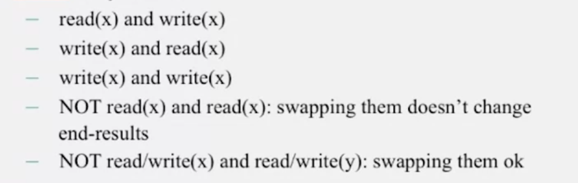
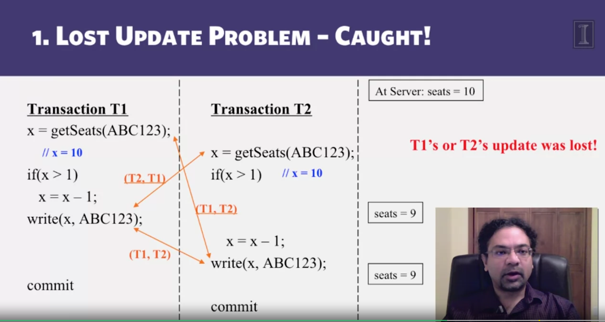

# When many transactions happen concurrently, we need a mechanism to increase concurrency while maintaining correctness without blocking anything

Two operations are conflicting each other when their **combined effect** depends on the order of execution

ex:
- read(x) then write(x)
- write(x) then read(x)

two transaction are SERIALLY EQUIVALENT if all pairs of conflict operations (one of each transaction) are executed in the same order

- take all pair of conflicting operations from 2 transaction (one from T1 and one from T2)
- if T1 was reflected first, mark that pair as (T1, T2) other wise (T2, T1)
- all pairs should be (T1, T2) or (T2, T1)
  

