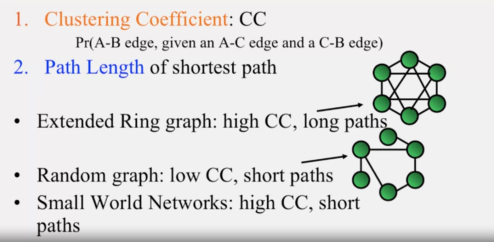
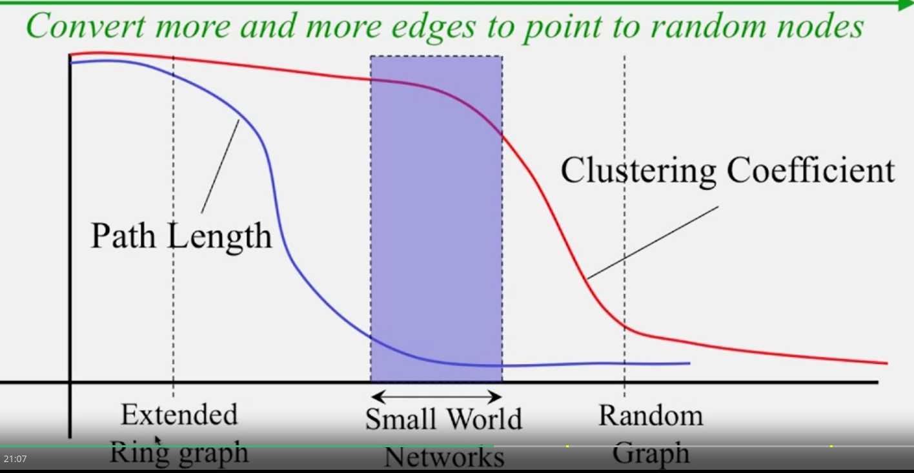
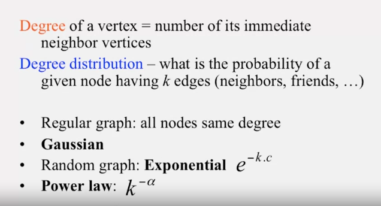
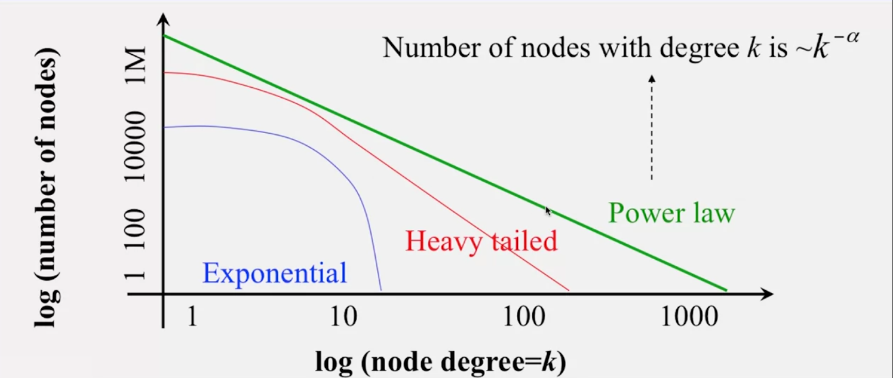

# a network has two important properties
- **Clustering Coefficient**: CC (A -> B given A -> C and C -> B)
- **Path Length** of shortest path

# Degree
- degree of a vertex is number of its adjacent neighbor

- degree distribution: the probability of a given node having k edges

