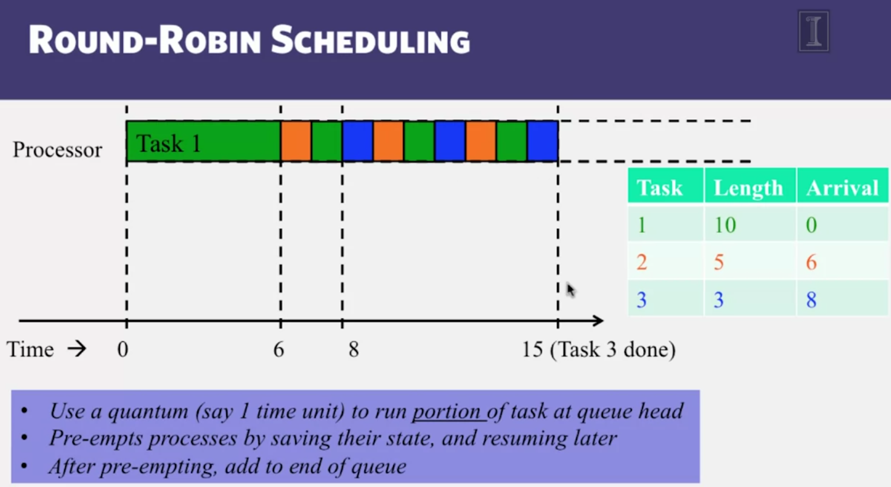

# FIFO
# Shortest task first - STP
- reduce average completion time
- good for batch application

# Round robin
share resources, execute each task in an unit of time

- good for interactive application (mouse or keyboard event)

