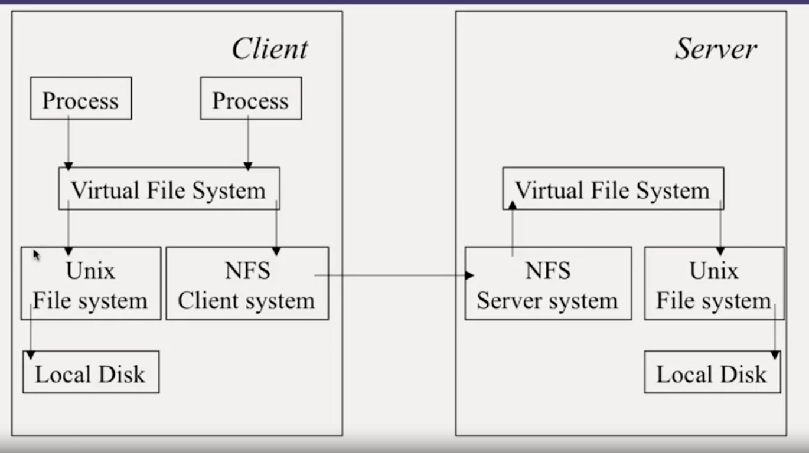

# NFS

use a virtual filesystem, client can not distinguish between local and remote files

can optimize server by using caching
- cache frequently used blocks
- write support writing in memory, flush every interval, or write immediately to disk

Client can implement caching
use timestamp to cache blocks, get validation from server every interval

# AFS
serve whole file, no blocks, cache the whole file

business allow that mechanism to be implemented
- file are accessed by a single user
- most files are small
- read much more often than write