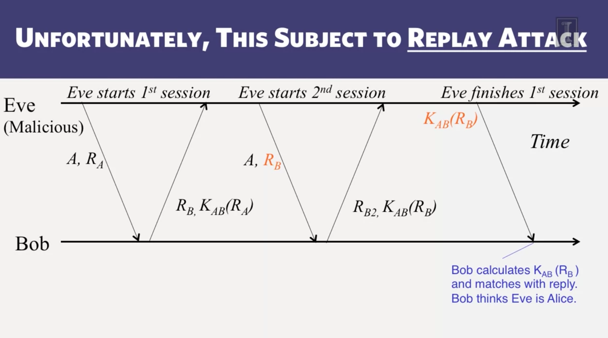
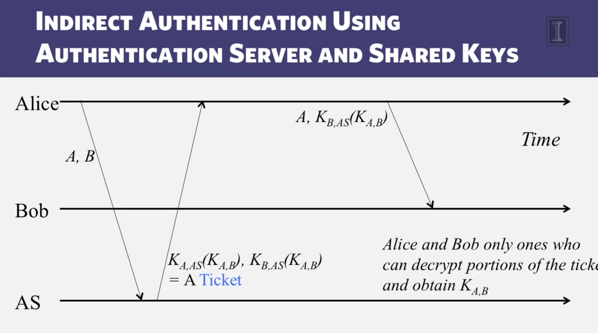

# direct authentication using shared key

each size send a random number, then request encrypted version from other side to check the result, if ok then authenticated, start communicating

can not optimized number of messages, because of replay attack

# indirect authentication using auth server and shared keys

# digital signature

when send a message, Alice can encrypted message using her private key

send message [M, privated_encoded(M)]

anyone can verify with Alice publickey -> know that message was sent from Alice

