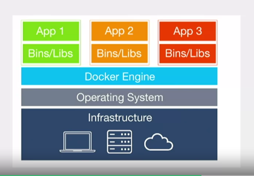

a docker container contains all code, runtime, packages to act as an OS

the binary layer of container acts as it is communicating with a real OS, and the docker engine map those commands to the real OS under

all new update on a container create a new part (or you can call it "layer"), so updating to a new version simply means that we install those new part, this make upgrading or downgrading much easier

