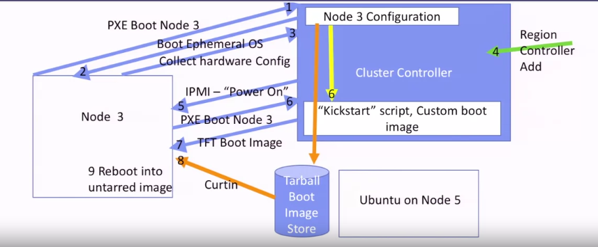

# metal as a service

allow user to manage, boot and user a large number of clustered computers, via UI, ssh,...

1, boot machine
    - new machine can download boot tarball from another node in cluster (via cluster manager's instructions), then boot itself up
    - this unbooted machine can be controlled physically via a BMC (baseboard management controller). This BMC can receive instructions in a network and control machine's physical devices
2, run services
    - after booted, that machine can be used as IaaS concepts

