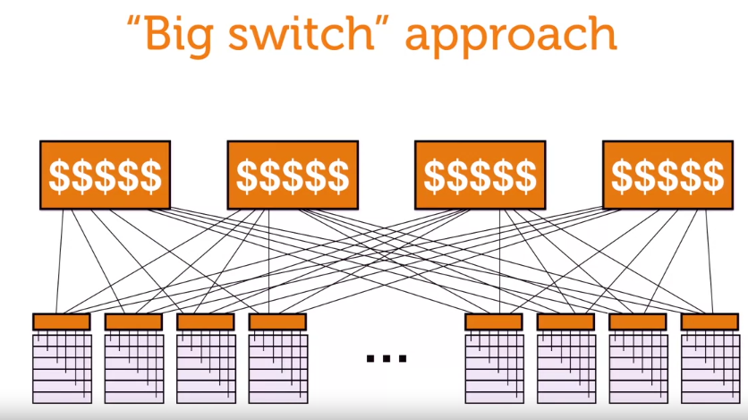
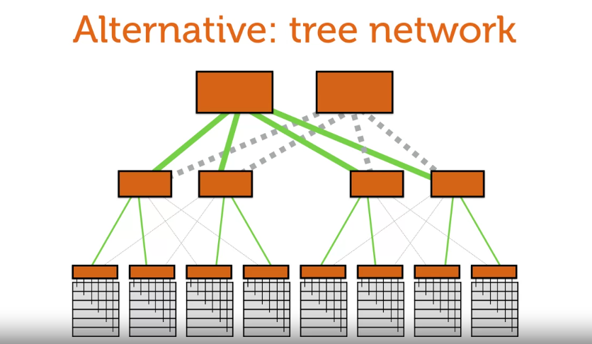
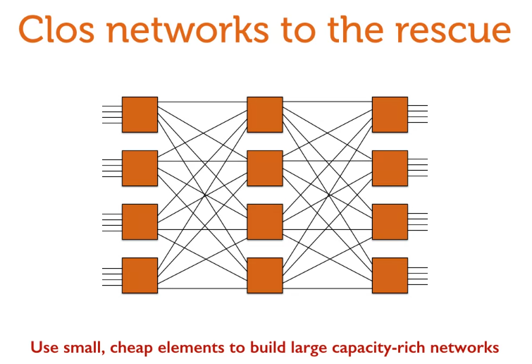
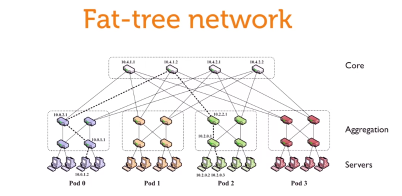

# big switch

it's some similar to P2P system, reducing bottleneck point, but large-number-port switches are too expensive

# tree network

can increase number of port at leaf nodes, but have bottleneck of root node

leaf nodes still need big switches

# clos network

increase number of route capacity, but using cheap switches

